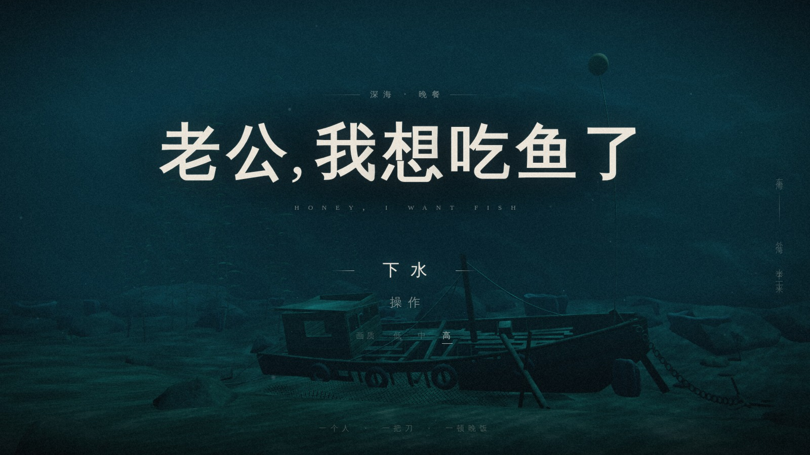
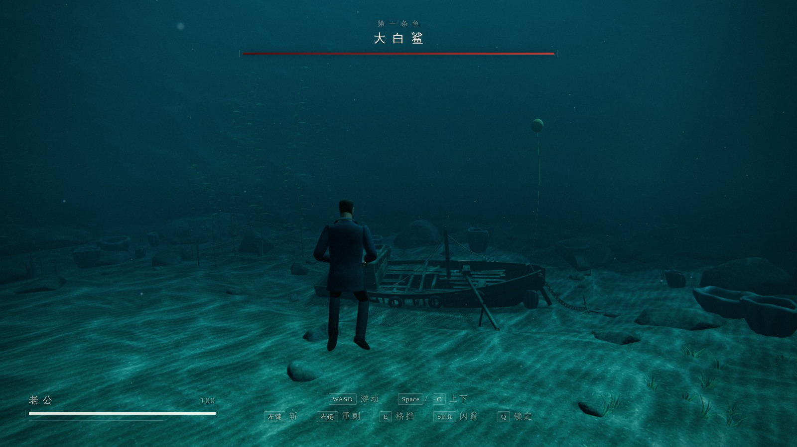
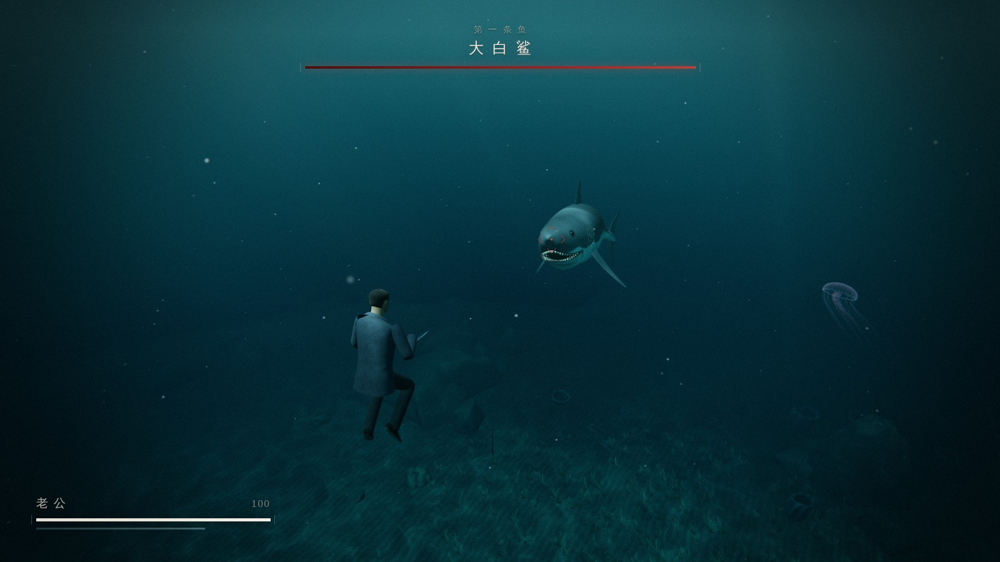
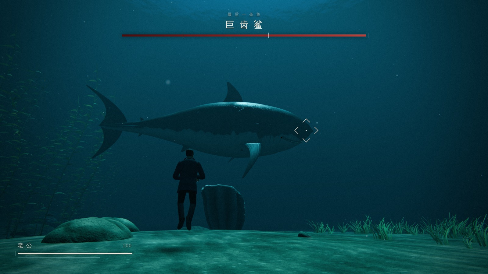

# 老公，我想吃鱼了

> 老婆：「老公，我想吃鱼了。」
> 老公：「好嘞，晚饭交给我！」

一款 three.js / WebGL 3D 水下动作格斗游戏。老婆随口说想吃鱼，老公却认真过了头，
拎着一把杀鱼刀跳进东海外海，想给晚饭弄条大的。在二三十米深、能见度只有五十米的
浑水里，他接连对上一条大白鲨、一对虎鲨，最后是一条十六米长的巨齿鲨。
老公可以在水下无限憋气，不需要任何潜水装备。人物为独立虚构的夫妻，
故事围绕一次夸张的晚饭采购展开，副标题为「深海 · 晚餐」。

所有模型、贴图、音效和音乐都由代码程序化生成，游戏运行时不依赖外部美术或音频素材，
也不使用任何真人演员的形象。

在线试玩：https://evegoodevening.github.io/honey-i-want-fish/

## 游戏截图

以下为高画质下的游戏实机截图，点击图片可查看大图。

| 深海 · 晚餐 | 海底沉船 |
| --- | --- |
|  |  |
| **大白鲨逼近** | **巨齿鲨掠过** |
|  |  |

## 运行

```bash
npm install
npm run dev        # http://127.0.0.1:5173
npm run build      # 产物在 dist/
npm run preview    # 预览构建结果
```

需要支持 WebGL2 的桌面浏览器（Chrome / Edge / Firefox / Safari 新版），推荐独立显卡。
首次启动会根据显卡自动选择画质（低 / 中 / 高），也可以在标题画面切换，选择会被记住；
URL 参数 `?quality=low|medium|high` 可临时覆盖。

## 操作

| 操作 | 按键 |
|---|---|
| 游动（跟随镜头方向，含上下） | W A S D / 方向键 |
| 上浮 / 下潜 | Space / C |
| 视角 | 鼠标（点击画面锁定指针） |
| 快刀（三段连斩） | 鼠标左键 / J |
| 重刺（按住蓄力，松开突刺） | 鼠标右键 / K |
| 闪避（无敌帧，耗体力） | Shift |
| 格挡（看准咬合瞬间，成功后可反击；蓄力中也可格挡） | E / L |
| 锁定 / 取消锁定（锁定画面上最靠近中央的鱼，60 米内） | Q / Tab / 鼠标中键 |
| 暂停 | Esc / P |

被鲨鱼咬住时，狂按左键 / J 刺它的眼睛挣脱。

## 玩法要点

- 鲨鱼会先在能见度边缘绕圈、试探，然后才真正发起攻击；两次进攻之间，它还会不时退回
  浑水里，只剩一个影子。注意画面边缘的威胁提示，听心跳和配乐的变化。
- 每次扑咬和冲撞前都有明显的预备动作（拱背、垂胸鳍、张嘴）。真正撞上之前约 0.2–0.4 秒
  还有一个"就是现在"的提示：锁定时准星收紧闪白，并有一声水流涌动的提示音（第一关的
  前两次还会在旁边写出「现在 —— E 格挡」）。听到提示再按格挡就来得及，可以弹开它；
  格挡成功后 0.6 秒内出刀（快刀，或立刻开始蓄力的重刺）会自动突进，反击它的要害。
- 鲨鱼贴得太近时会先张着大嘴悬停一下再合口，提示照样会出现，照样可以格挡。
- 格挡可以打断重刺的蓄力（已经消耗的体力不退）和出刀的前摇、收招，蓄力时看到提示
  照样可以格挡。
- 眼睛和鳃是要害，伤害翻倍甚至三倍。
- 乱按格挡会被惩罚（消耗体力、窗口变短）；只是慌乱中按早了一次，立刻再按一次还来得及。
- 贴着鲨鱼的头一味猛砍、不防守，它不会只顾逃开，而是当场回咬或者甩尾；被连着砍的时候，
  它们的撕咬更疼、会把你撞开，但不会咬住不放。
- 游到海沟上方、场地边缘或太深的地方，鲨鱼会慢慢把战斗带回有光的开阔水域。
- 巨齿鲨有三个阶段：血量低于 60% 和 25% 时会怒吼，把你推开；甩尾掀起的冲击波不能格挡，
  要靠闪避躲开。怒吼和冲击波之后它会短暂露出破绽，这时伤害更高。

## 项目结构

```
src/core/      Game 主循环、输入、配置、画质检测
src/world/     海底地形、礁壁、海沟、沉船、海草、水面（斯涅尔窗）、光柱、焦散、悬浮颗粒、雾
src/world/ambient/  鱼群、水母、远处的抹香鲸
src/render/    后期处理（HDR、泛光、水下折射、调色、暗角、各类冲击效果）
src/player/    老公：程序化模型、骨骼、分层程序动画、杀鱼刀、游泳物理
src/enemies/   鲨鱼几何与皮肤生成、骨骼动画、AI（绕圈 / 试探 / 扑咬 / 冲撞 / 甩尾 / 包抄）、巨齿鲨三阶段
src/combat/    命中判定（扫掠）、格挡 / 完美闪避、咬住 QTE
src/camera/    第三人称镜头、锁定、震动、过场镜头
src/vfx/       血雾、气泡、刀光、冲击波、泥沙
src/audio/     全程序化 WebAudio：水下混音、自适应配乐、心跳、音效
src/ui/, src/game/   界面、HUD、关卡流程（Director）
```

模块之间的接口约定见 [`docs/DESIGN.md`](docs/DESIGN.md)。开发说明、测试脚本和踩过的坑
见 [`AGENTS.md`](AGENTS.md)。

## 测试

`scripts/` 下有无头浏览器冒烟测试和各模块的场景脚本（`scripts/smoke.mjs` 及
`*-scenario.mjs`、`render-checks.mjs`、`uiflow-guidance.mjs` 等），以及不需要浏览器的
节奏 / 平衡 / 镜头模拟器（`scripts/enemies-sim.mjs`、`scripts/core-parry-sim.mjs`、
`scripts/combat-camsim.mjs`、`scripts/render-whale-sim.mjs`、`scripts/world-checks.mjs`）。
浏览器测试会启动 Chromium，具体用法见 `AGENTS.md`。

## 第三方许可

游戏使用 three.js，其版权声明和 MIT 许可全文见
[`THIRD_PARTY_NOTICES.txt`](public/THIRD_PARTY_NOTICES.txt)，也可从游戏标题页的
「第三方许可」查看。该文件随构建复制到 `dist/THIRD_PARTY_NOTICES.txt`，并随网站一起发布。

当前字体通过 CSS 和 Canvas 调用设备已有字体，项目不分发字体文件。
第三方许可声明仅适用于所列第三方组件，不表示项目自身代码采用 MIT 许可。
